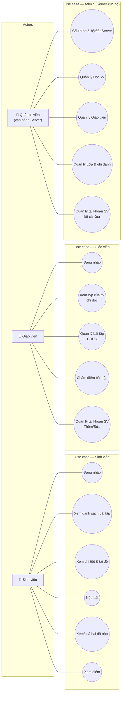
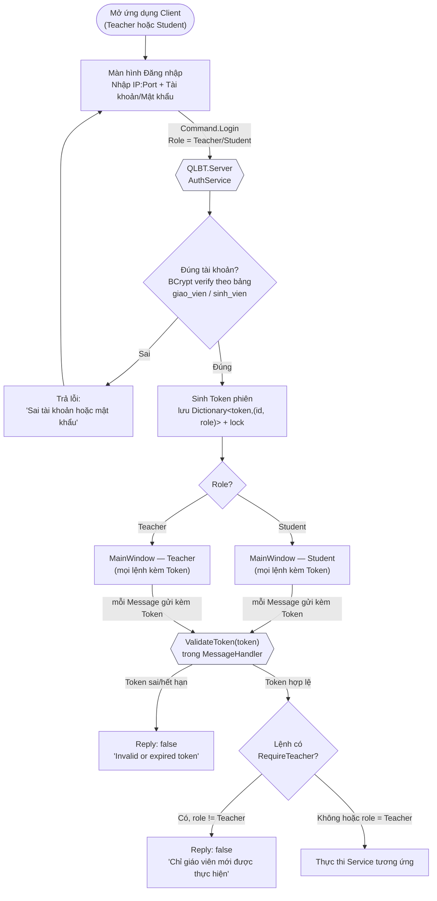
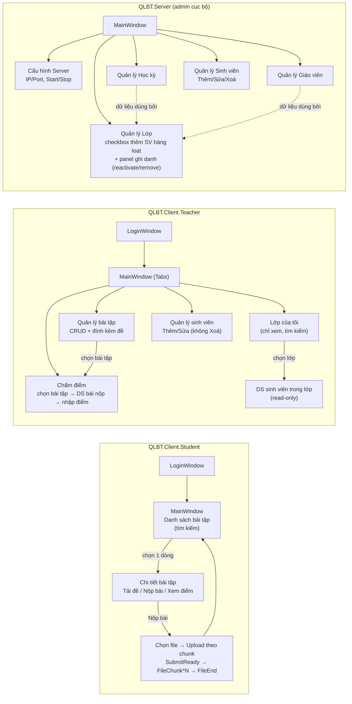
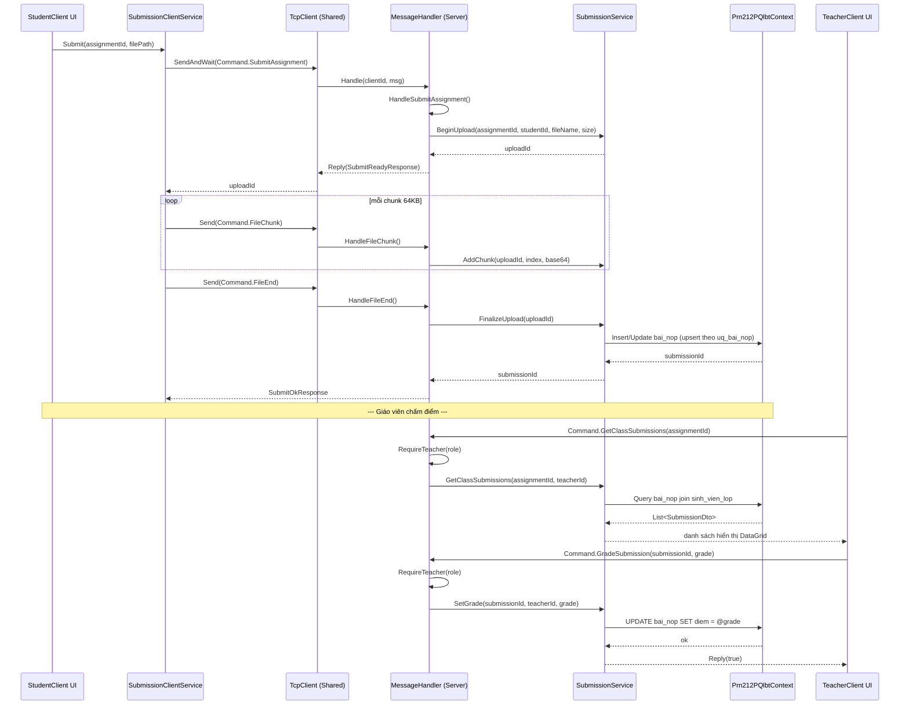
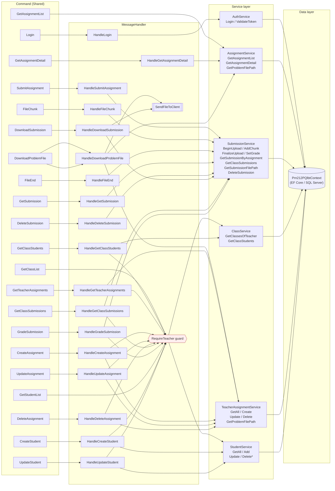
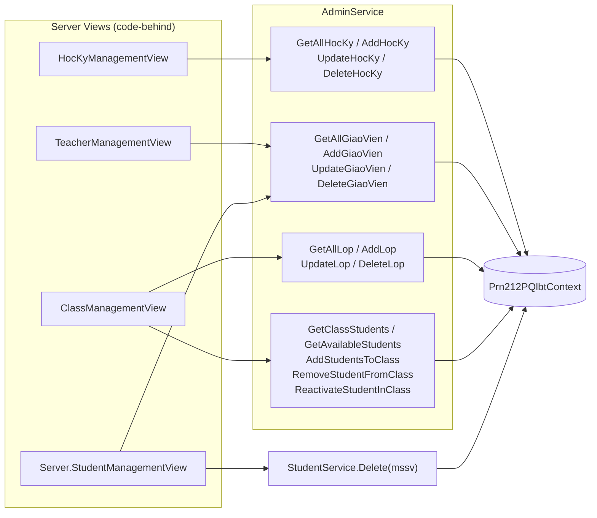
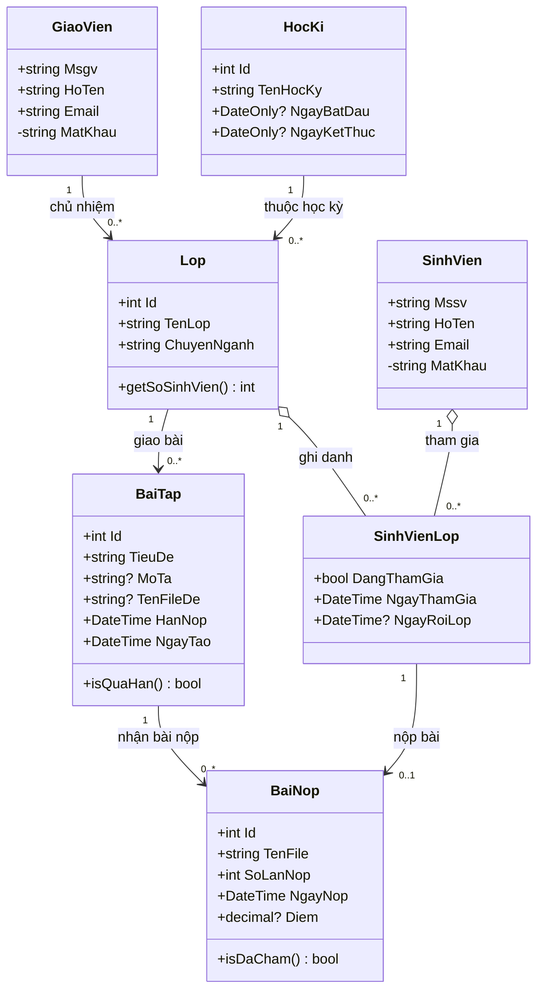

<!-- title: QLBT — Sơ đồ hệ thống -->

# QLBT — Sơ đồ kiến trúc & luồng nghiệp vụ

Hệ thống quản lý bài tập (QLBTv2): 3 ứng dụng WPF (`QLBT.Server`, `QLBT.Client.Teacher`, `QLBT.Client.Student`) giao tiếp qua TCP (WatsonTcp), dùng chung thư viện `QLBT.Shared`.

---

## 1. Actor & Use Case

**Ghi chú phân quyền:** Giáo viên **không còn** quyền xoá tài khoản sinh viên hay quản lý Lớp (CRUD) — hai việc này chỉ còn ở màn hình admin nội bộ của `QLBT.Server`, không đi qua TCP.

---

## 2. Sơ đồ xác thực (Screen Authorization)

`QLBT.Server`'s own admin views (Học kỳ / Giáo viên / Lớp / Sinh viên) chạy **cục bộ trong tiến trình Server**, gọi thẳng `IAdminService`/`IStudentService` — không qua bước xác thực Token/TCP ở trên vì không rời khỏi máy chủ.

---

## 3. Luồng màn hình (Screen Flow) theo từng app

---

## 4. Sơ đồ gọi hàm (Function Call Graph) — luồng "Nộp bài" & "Chấm điểm"

---

## 5. Sơ đồ đa đồ thị gọi hàm (Function Call Multigraph) — `QLBT.Server`

Mọi `case` trong `MessageHandler.HandleInner` (đỉnh trái) gọi vào đúng một `Handle...` nội bộ, rồi xuống lớp Service tương ứng, rồi tới `Prn212PQlbtContext` (EF Core). Đây là đồ thị tĩnh toàn bộ lệnh TCP — nhiều cạnh cùng đổ vào một node Service (đa đồ thị), thể hiện việc tái sử dụng service giữa các lệnh khác nhau.

`Stu.Delete*` không còn đích gọi nào từ `MessageHandler` (đã gỡ khỏi TCP) — chỉ còn được gọi trực tiếp bởi `QLBT.Server.Views.StudentManagementView` (admin cục bộ), minh hoạ ở đồ thị dưới.

### 5b. Nhánh gọi cục bộ — Admin UI của `QLBT.Server` (không qua TCP)

---

## 6. Sơ đồ lớp (Class Diagram) — Domain Model (EF Core)

**Ghi chú:**
- `SinhVienLop` là bảng trung gian (association class) giữa `Lop` và `SinhVien` — mang thêm thuộc tính riêng (`DangThamGia`, ngày tham gia/rời lớp) nên không thể gộp thành quan hệ nhiều-nhiều thẳng.
- Ràng buộc `uq_bai_nop (BaiTapId, Mssv)` khiến mỗi sinh viên chỉ có tối đa **1** bài nộp cho mỗi bài tập → quan hệ `SinhVienLop → BaiNop` là `0..1`, không phải nhiều.
- `MatKhau` đánh dấu `-` (private) vì chỉ dùng nội bộ để BCrypt-verify khi đăng nhập, không lộ ra DTO/API nào.
